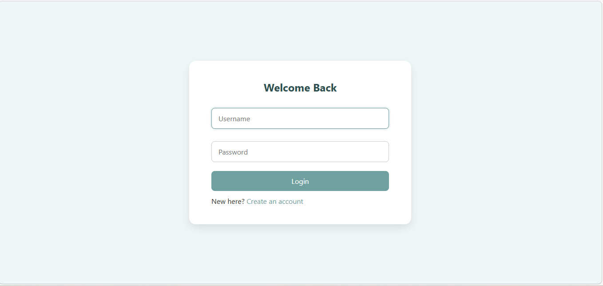
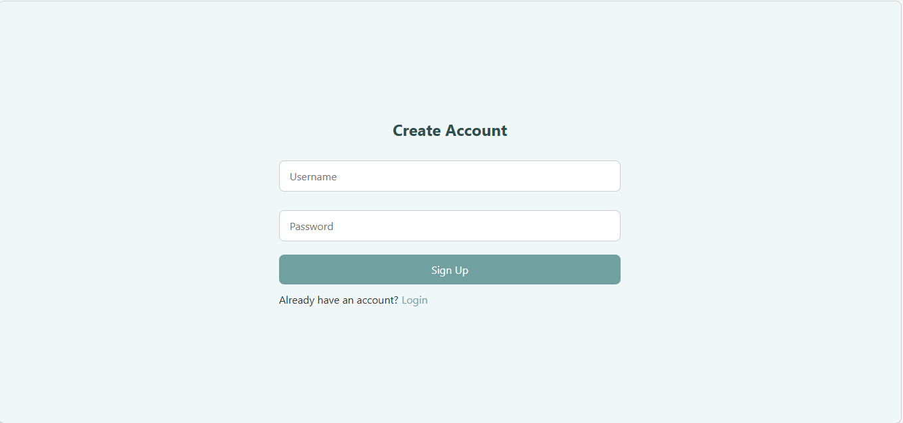
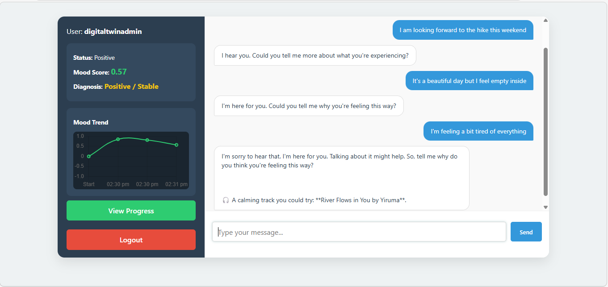
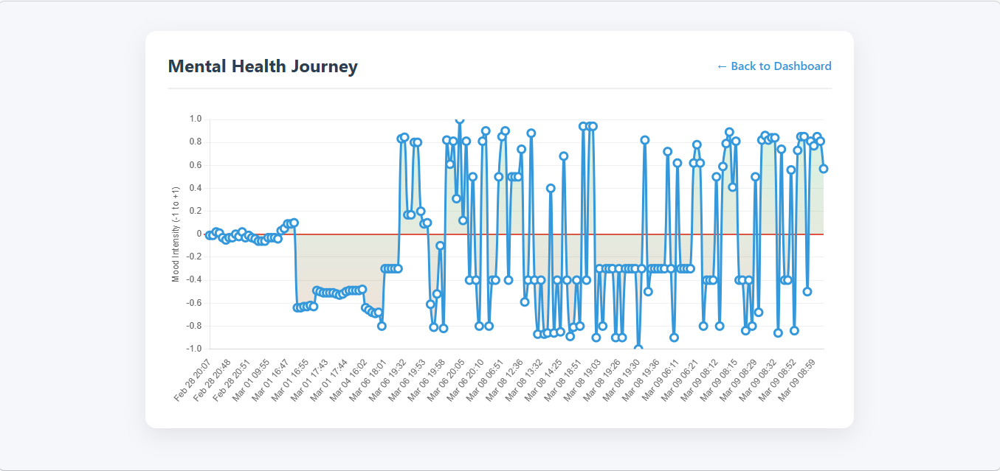

# Mental-health-chatbot
Mental Health Chatbot: An NLP-based chatbot that provides basic emotional support and self-care guidance. It uses context-aware responses to simulate empathetic conversations for managing stress and anxiety. Built with Python using a hybrid rule-based and ML approach.

## Output

## Methodology
- Python  
- NLP Techniques 
- Models: LSTM, BERT 
